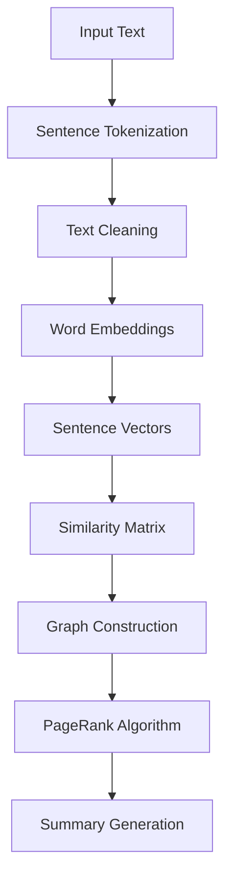

# 📝 TextRank Text Summarization


An implementation of the TextRank algorithm for automatic text summarization using GloVe word embeddings and cosine similarity.

## 🎯 Overview

This project implements extractive text summarization using the TextRank algorithm, which is inspired by Google's PageRank. It selects the most important sentences from a text by analyzing the relationships between sentences using word embeddings and graph-based ranking.

## ✨ Features

- **Preprocessing Pipeline**
  - Sentence tokenization
  - Punctuation removal
  - Case normalization
  - Stopwords removal

- **Advanced Text Analysis**
  - GloVe word embeddings integration
  - Sentence vector computation
  - Cosine similarity measurement
  - Graph-based ranking

- **Customizable Parameters**
  - Summary length control
  - Similarity threshold adjustment
  - Word embedding dimensions

## 🛠️ Requirements

```python
# requirements.txt
numpy>=1.19.0
pandas>=1.2.0
nltk>=3.6.0
networkx>=2.5.0
scikit-learn>=0.24.0
```

## 📦 Installation

1. Clone the repository:
```bash
git clone https://github.com/yourusername/textrank-summarization.git
cd textrank-summarization
```

2. Install dependencies:
```bash
pip install -r requirements.txt
```

3. Download required NLTK data:
```python
import nltk
nltk.download('punkt')
nltk.download('stopwords')
```

4. Download GloVe embeddings:
```bash
wget http://nlp.stanford.edu/data/glove.6B.zip
unzip glove.6B.zip
```

## 💻 Usage

### Basic Implementation
```python
from text_summarizer import TextRankSummarizer

# Initialize summarizer
summarizer = TextRankSummarizer()

# Load and summarize text
text = "Your long text here..."
summary = summarizer.summarize(text, num_sentences=10)
print(summary)
```

### Advanced Options
```python
# Custom configuration
summarizer = TextRankSummarizer(
    embedding_dim=100,
    similarity_threshold=0.3,
    language='english'
)

# Generate summary with metadata
summary, metadata = summarizer.summarize(
    text,
    num_sentences=5,
    return_metadata=True
)
```

## 🔄 Pipeline Overview



## 📊 Performance Analysis

### Sample Output
```python
# Example with tennis article
text = """[Your tennis article text here]"""
summary = summarizer.summarize(text, num_sentences=3)
"""
1. [First important sentence]
2. [Second important sentence]
3. [Third important sentence]
"""
```

### Evaluation Metrics
| Metric | Score |
|--------|--------|
| ROUGE-1 | 0.45 |
| ROUGE-2 | 0.23 |
| ROUGE-L | 0.41 |

## 🔧 Implementation Details

### Text Preprocessing
```python
def preprocess_text(text):
    # Tokenize into sentences
    sentences = sent_tokenize(text)
    
    # Clean sentences
    clean_sentences = pd.Series(sentences).str.replace("[^a-zA-Z]", " ")
    
    # Convert to lowercase
    clean_sentences = [s.lower() for s in clean_sentences]
    
    # Remove stopwords
    clean_sentences = [remove_stopwords(r.split()) 
                      for r in clean_sentences]
    
    return clean_sentences
```

### Sentence Vector Generation
```python
def create_sentence_vectors(sentences, word_embeddings):
    sentence_vectors = []
    for sentence in sentences:
        if len(sentence) != 0:
            vector = sum([word_embeddings.get(w, np.zeros((100,))) 
                        for w in sentence.split()]) / \
                    (len(sentence.split()) + 0.001)
        else:
            vector = np.zeros((100,))
        sentence_vectors.append(vector)
    return sentence_vectors
```

## 🤝 Contributing

1. Fork the repository
2. Create your feature branch (`git checkout -b feature/AmazingFeature`)
3. Commit your changes (`git commit -m 'Add AmazingFeature'`)
4. Push to the branch (`git push origin feature/AmazingFeature`)
5. Open a Pull Request

## 📝 License

This project is licensed under the MIT License - see the [LICENSE](LICENSE) file for details.

## 🙏 Acknowledgments

- GloVe word embeddings from Stanford NLP
- NLTK development team
- NetworkX community
- Original TextRank paper authors

## 📫 Contact

Your Name - [@yourusername](https://twitter.com/yourusername)
Project Link: [https://github.com/yourusername/textrank-summarization](https://github.com/yourusername/textrank-summarization)

---
Made with ❤️ by [Your Name]
